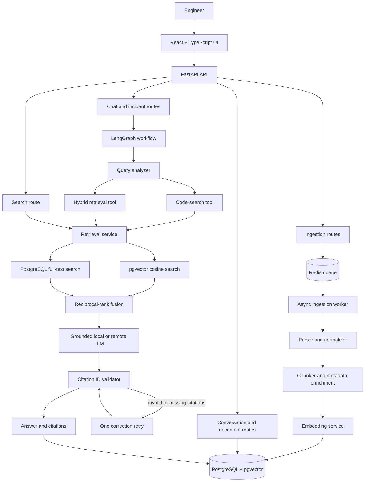
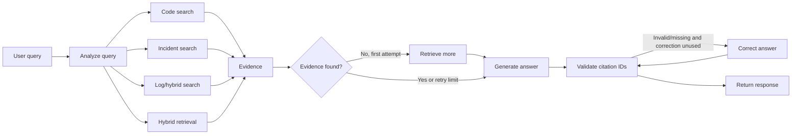
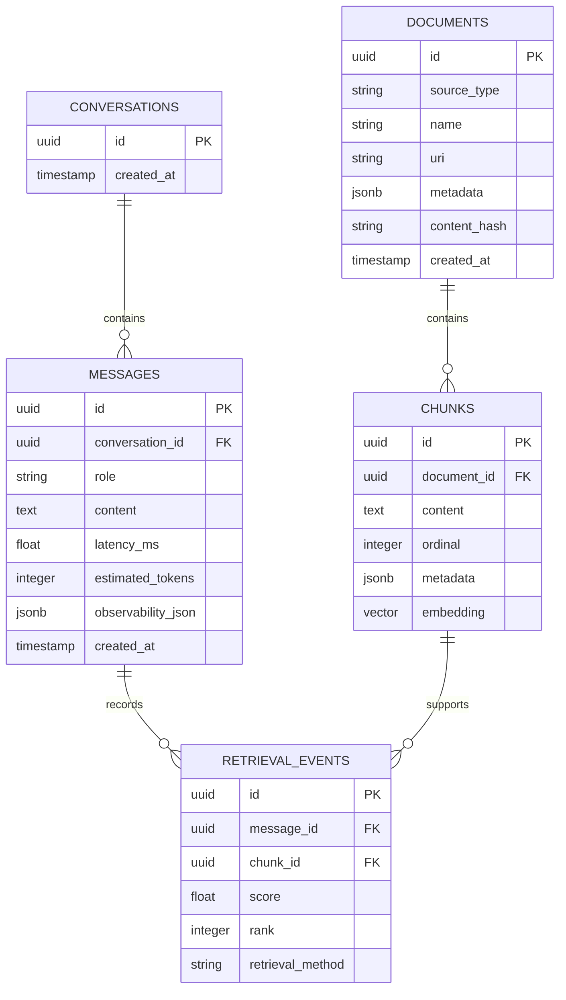

# DevMind Architecture

DevMind is an incident-intelligence platform for answering engineering
questions from indexed documentation, source code, logs, deployment records, and
incident reports. The system combines asynchronous ingestion, PostgreSQL and
pgvector storage, hybrid retrieval, LangGraph orchestration, grounded answer
generation, citation validation, and a React frontend.

This document describes the architecture implemented in the repository. It does
not claim that the AWS Terraform configuration is a live production deployment.

## 1. System overview



## 2. Technology stack

| Layer | Technology | Responsibility |
| --- | --- | --- |
| User interface | React, TypeScript, Vite | Query, ingestion, incident analysis, evidence, and evaluation screens |
| API | FastAPI | HTTP endpoints, validation, OpenAPI documentation, CORS, and request IDs |
| Workflow | LangGraph | Query routing, retrieval tool selection, bounded retries, generation, and citation validation |
| Runtime | Python 3.12, `uv` | Application runtime and dependency management |
| Relational database | PostgreSQL | Documents, chunks, conversations, messages, incidents, retrieval events, and evaluation runs |
| Vector database capability | pgvector | 1,536-dimensional embedding storage and cosine-distance search |
| Keyword retrieval | PostgreSQL full-text search | Exact identifiers, error strings, paths, class names, and operational terms |
| Queue and job state | Redis | Ingestion queue, job progress, retry state, and short-lived orchestration state |
| Background processing | Python worker | Consumes Redis jobs and persists indexed documents |
| Embeddings | Local deterministic provider or OpenAI-compatible provider | Converts document chunks and queries into vectors |
| Generation | Local grounded generator or OpenAI-compatible chat completion | Produces evidence-grounded answers with citation IDs |
| Packaging and local operations | Docker Compose | Runs PostgreSQL, Redis, API, worker, and frontend together |
| Cloud infrastructure | Terraform and AWS resources | Defines ECR, S3, RDS, ElastiCache, ECS, ALB, and IAM resources |

## 3. Runtime services

### 3.1 React frontend

The frontend is a Vite-built React application in `frontend/`.

It provides:

- A primary grounded-question workflow.
- Retrieval mode selection: hybrid, semantic, or keyword.
- Source ingestion for text-based files and pasted content.
- Local repository or corpus indexing.
- Incident analysis.
- Retrieved evidence display.
- Readable citation names mapped from citation chunk IDs.
- Indexed-document inventory.
- Evaluation execution and summary metrics.

The frontend communicates with the API using JSON over HTTP. It does not access
PostgreSQL, Redis, or provider credentials directly.

### 3.2 FastAPI API

The API is implemented in `backend/app/main.py`.

Important responsibilities:

- Validate request bodies with Pydantic schemas.
- Expose OpenAPI documentation.
- Add an `X-Request-ID` to each request and response.
- Route chat requests into the LangGraph workflow.
- Queue asynchronous ingestion jobs.
- Index repository snapshots.
- Execute search and evaluation operations.
- Persist conversations, messages, incidents, and retrieval telemetry.
- Apply CORS rules for the frontend.

Main endpoint groups:

| Endpoint | Purpose |
| --- | --- |
| `GET /health` | API health check |
| `POST /documents` | Persist one document immediately |
| `GET /documents` | List indexed documents |
| `POST /ingestions` | Queue one document for worker processing |
| `GET /ingestions/{job_id}` | Read ingestion progress and status |
| `POST /repositories/index` | Parse and index a repository or folder snapshot |
| `POST /search` | Run semantic, keyword, or hybrid retrieval |
| `POST /chat` | Run the LangGraph grounded assistant |
| `GET /conversations/{conversation_id}` | Read persisted conversation messages |
| `POST /incidents/analyze` | Generate a structured incident analysis |
| `POST /evaluations/run` | Execute the stored evaluation dataset |
| `GET /evaluations/{run_id}` | Read an evaluation result |

### 3.3 PostgreSQL and pgvector

PostgreSQL is the system of record. The `chunks.embedding` column uses
`VECTOR(1536)` and stores one vector per indexed chunk.

The database stores:

- Source document identity and metadata.
- Normalized content chunks.
- Embeddings and embedding provider metadata.
- Incident analyses.
- Conversations and messages.
- Retrieval events associated with assistant messages.
- Evaluation runs and case-level results.

The application initializes the `vector` extension and creates missing tables
when persistence is enabled. Existing databases receive the
`messages.observability_json` column upgrade if it is missing.

### 3.4 Redis

Redis is used for asynchronous ingestion. The queue name is
`devmind:ingestion`.

For each queued document, Redis stores:

- Job ID.
- Payload.
- Status.
- Progress percentage.
- Attempt count.
- Error text when a failure occurs.

The worker consumes the queue with a blocking pop. Jobs are retried up to three
attempts. Final failures remain visible through the ingestion status endpoint.

### 3.5 Ingestion worker

The worker is implemented in `backend/app/worker.py`.

Its lifecycle is:

1. Wait for a job on `devmind:ingestion`.
2. Load the job payload from Redis.
3. Mark the job as `processing`.
4. Create a database session.
5. Normalize, chunk, embed, and persist the document.
6. Mark the job `completed` with its document ID.
7. On failure, mark it `retrying` and requeue it until the retry limit.
8. Mark the final failure as `failed`.

The worker and API share the same persistence and embedding services, which
keeps synchronous and asynchronous indexing behavior consistent.

## 4. Ingestion architecture

### 4.1 Ingestion entry points

There are two ingestion paths:

#### Queued document ingestion

Used by the frontend and `POST /ingestions`.

```text
Text/file content
    |
    v
FastAPI validates DocumentCreate
    |
    v
Redis job record + queue entry
    |
    v
Background worker
```

#### Repository snapshot indexing

Used by `POST /repositories/index`.

```text
Repository or folder path
    |
    v
Recursive file discovery
    |
    v
Extension filtering and excluded-directory filtering
    |
    v
File parsing and metadata enrichment
    |
    v
Bulk persistence
```

Repository indexing accepts common engineering formats including Python,
JavaScript, TypeScript, Java, Go, Rust, SQL, Markdown, text, YAML, JSON, and
logs. It skips `.git`, `.venv`, `node_modules`, and `__pycache__` directories.

### 4.2 Parsing

The parser layer supports:

- Plain text.
- Markdown.
- HTML and HTM.
- PDF through `pypdf`.
- Logs.
- Repository source files.

Every parsed source is normalized before chunking. Empty content after
normalization is rejected rather than indexed as an empty document.

Metadata includes:

- Source type.
- Source name.
- URI.
- Relative path.
- Service name when supplied.
- Repository commit SHA when available.
- File format.
- Repository root.

### 4.3 Chunking and persistence

The persistence service performs:

1. SHA-256 content hashing.
2. Duplicate detection by content hash.
3. Overlapping text chunking.
4. Embedding generation for each chunk.
5. Embedding metadata attachment.
6. Document and chunk insertion in one database operation.

Duplicate content is returned as an existing document instead of creating a
second copy.

### 4.4 Embedding providers

The embedding service supports two modes:

#### Local mode

The default local provider is deterministic and does not require an API key.
It produces 1,536-dimensional vectors compatible with the current pgvector
column.

This mode is useful for:

- Local development.
- Repeatable tests.
- Offline indexing.
- Avoiding embedding API costs.

#### OpenAI-compatible mode

An OpenAI-compatible `/embeddings` endpoint can be configured through
environment variables. The returned vector dimension is checked against the
database schema before persistence.

Changing to a model with a different dimension requires a database migration and
full re-embedding. The application intentionally rejects incompatible
dimensions.

## 5. Retrieval architecture

### 5.1 Query embedding

For semantic and hybrid retrieval, the query is embedded using the same
configured embedding provider used for indexed chunks. Using the same embedding
space is required for meaningful cosine-distance comparisons.

### 5.2 Semantic retrieval

Semantic retrieval:

1. Generates a query embedding.
2. Calculates cosine distance against `chunks.embedding`.
3. Joins chunks to their parent documents.
4. Returns the nearest candidates.

### 5.3 Keyword retrieval

Keyword retrieval uses PostgreSQL full-text search:

1. Converts chunk content into a `simple` text-search vector.
2. Converts the user query into a web-search query.
3. Matches relevant chunks.
4. Ranks matches with `ts_rank_cd`.

This path is important for exact identifiers, error messages, file paths, class
names, and API routes that semantic search may not preserve precisely.

### 5.4 Hybrid retrieval and reranking

Hybrid retrieval executes both semantic and keyword searches. Candidate chunks
are merged by chunk ID, duplicate candidates are removed, and each candidate
receives semantic and/or keyword rank information.

The final ranking uses reciprocal-rank fusion (RRF). The top candidates are
returned with:

- Chunk ID.
- Document ID and document name.
- Content.
- Fused score.
- Final rank.
- Retrieval method.
- Source metadata.

## 6. LangGraph query processing

The agent workflow is implemented in `backend/app/graph/workflow.py`.



### 6.1 Query analysis

The query analyzer selects a route using bounded classification rules:

- Code terms, source paths, and implementation questions select `code_search`.
- Incident, outage, failure, timeout, rollback, and stack-trace terms select
  `incident_analysis`.
- Log, trace, request ID, and exception terms select `log_search`.
- Other questions select `hybrid_retrieval`.

### 6.2 Tool selection

- `code_search_tool` performs keyword retrieval and keeps repository/code
  results.
- `hybrid_retrieval_tool` performs combined vector and keyword retrieval.
- Incident and log routes use the hybrid retrieval implementation with route
  telemetry.

### 6.3 Bounded evidence retry

If the first retrieval returns no evidence, the graph performs one additional
retrieval attempt with a larger candidate count. The graph does not retry
indefinitely.

### 6.4 Answer generation

The answer generator receives:

- User query.
- Retrieved evidence.
- Citation IDs for the evidence.
- Instructions to separate evidence from inference.
- Instructions not to invent facts.

It can use either:

- The deterministic local grounded generator.
- An OpenAI-compatible chat completion provider.

Provider, model, latency, and token metadata are returned with the response.

### 6.5 Citation validation

The validator extracts UUID-style citation IDs from the generated answer and
checks that:

- At least one citation is present when evidence exists.
- Every cited ID belongs to the retrieved evidence.

If validation fails, the graph performs at most one corrective generation
attempt. This is an ID-level grounding check; it is not a full natural-language
claim-entailment model.

## 7. Chat response and observability

Each chat request receives an `X-Request-ID`. The API response can include:

- Selected route.
- Confidence.
- Evidence sufficiency.
- Citation list.
- LLM provider and model.
- Estimated or provider-reported token count.
- Retrieval latency.
- Retrieval retry count.
- Citation-validation status.
- Conversation ID.
- Assistant message ID.

The API persists the user message, assistant message, selected citations, and
observability metadata. Retrieval events connect an assistant message to the
chunks used to produce the answer.

This makes it possible to inspect a response after the request and correlate
latency, provider behavior, evidence, and citations.

## 8. Incident analysis

The incident endpoint adds the requested service name to the query and sends it
through the same LangGraph retrieval workflow.

When supporting evidence exists, the response contains:

- Root-cause hypothesis based on the strongest evidence.
- Affected component.
- Supporting citations.
- Recommended next steps.
- Confidence.
- Route.

When evidence is missing, the response explicitly reports that a reliable
hypothesis could not be formed and suggests indexing relevant logs, traces, or
deployment information.

The current implementation does not fabricate an incident timeline or
contributing factors when timestamped evidence is unavailable.

## 9. Persistence model



`incidents` and `evaluation_runs` are independent application tables. Foreign
keys use cascading deletes for dependent chunks, messages, and retrieval events.
Async conversation reads use eager loading to avoid SQLAlchemy lazy-loading
I/O outside the async context.

## 10. Local Docker architecture

The local stack is defined in `docker-compose.yml`:

```text
postgres: pgvector/pgvector:pg16
redis:    redis:7-alpine
api:      FastAPI application
worker:   Redis ingestion worker
frontend: Vite-built React application served by Nginx
```

Service relationships:

```text
frontend -> api:8000
api      -> postgres:5432
api      -> redis:6379
worker   -> postgres:5432
worker   -> redis:6379
```

The PostgreSQL and Redis volumes preserve data across ordinary container
rebuilds. Rebuilding an image does not clear database records. Data cleanup
must be performed with SQL or by intentionally removing volumes.

For safe local development, the root `.env` controls provider configuration
without committing secrets. The recommended current configuration uses local
embeddings and an independently configured LLM.

## 11. AWS deployment architecture

The Terraform configuration defines a deployment target consisting of:

- ECR repositories for API, worker, and frontend images.
- S3 for source artifacts.
- RDS PostgreSQL.
- ElastiCache Redis.
- ECS Fargate API service.
- ECS Fargate worker service.
- Application Load Balancer.
- Security groups and task execution IAM role.

The repository currently treats this as deployable infrastructure rather than a
verified production deployment. Production hardening still requires validation
of:

- HTTPS and ACM certificates.
- Private subnets and restricted network paths.
- Secrets Manager or SSM integration.
- Least-privilege task IAM.
- CloudWatch log configuration.
- Autoscaling and health behavior.
- Frontend hosting and routing.
- Database backup, migration, and recovery procedures.

## 12. Current architectural boundaries

The current implementation intentionally has these boundaries:

- Citation validation checks citation IDs, not claim-level entailment.
- Local embeddings are deterministic and suitable for repeatability, not a
  substitute for a quality benchmark using a representative production corpus.
- Evaluation metrics are application-level measurements and must be rerun after
  changing the embedding model, corpus, chunking strategy, or reranker.
- Repository indexing accepts local paths visible to the API process. A Docker
  API can only index host files that are mounted into the container.
- A live AWS URL is not implied by the presence of Terraform files.

## 13. End-to-end summary

```text
Engineer asks a question
        |
        v
React sends POST /chat
        |
        v
FastAPI assigns request ID
        |
        v
LangGraph analyzes query and selects a tool
        |
        v
Semantic + keyword retrieval query PostgreSQL
        |
        v
pgvector and PostgreSQL FTS candidates are fused and reranked
        |
        v
Grounded generator receives only retrieved evidence
        |
        v
Citation IDs are validated against retrieved chunks
        |
        v
One bounded correction retry if required
        |
        v
Answer, readable citations, metrics, and request metadata return to React
        |
        v
Conversation and retrieval telemetry are persisted in PostgreSQL
```

